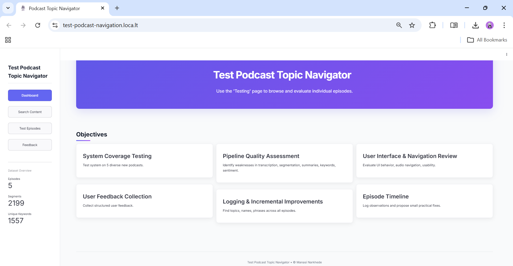
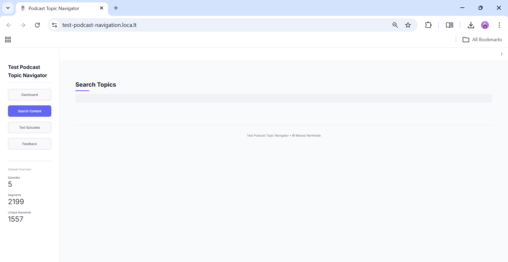
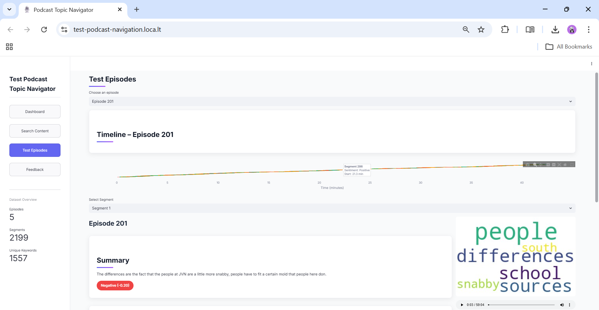
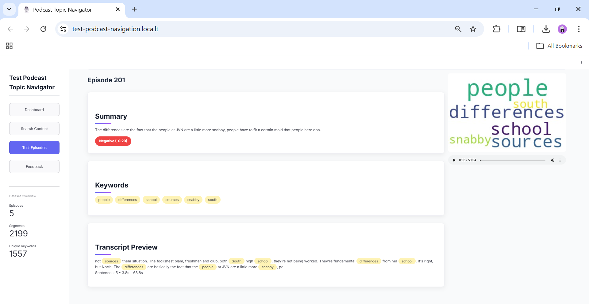
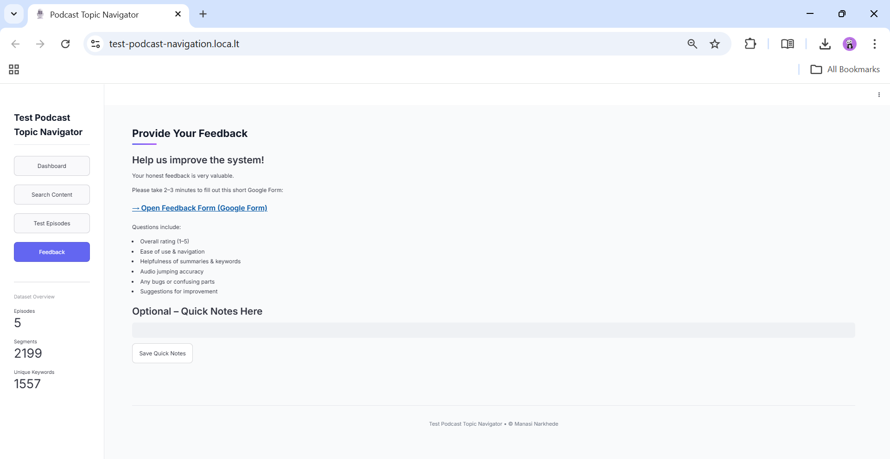

# 🎙️ Week 6: System Testing & Feedback Collection

> **Mission**: Validate the complete podcast-processing system through comprehensive testing, collect structured user feedback, and identify high-impact improvements for final deployment.

---

## 🎯 Week 6 Objectives

✓ Test the complete system on **5 diverse new podcast episodes**  
✓ Identify weaknesses across all key components:  
  - 🔤 **Transcription accuracy** — missing words, misheard phrases, speaker attribution  
  - 📍 **Topic segmentation quality** — logical boundaries, over/under-segmentation  
  - 📝 **Summary clarity** — conciseness, informativeness, main-point capture  
  - 🏷️ **Keyword relevance** — appropriateness to segment content  
  - 😊 **Sentiment labeling** — emotional tone alignment  
  - 🎛️ **UI behavior** — responsiveness, audio playback, navigation  

✓ Collect structured user feedback from **3–5 testers**  
✓ Log observations systematically in the testing log  
✓ Propose **small, practical improvements** (no major redesign)

---

## 📋 Testing Details

### 🎵 Test Episodes

| Property | Path |
|----------|------|
| **Raw Audio** | `data/test/audio_raw/` |
| **Processed Segments** | `data/test/segmented_outputs/week6_test/` |
| **Episode Count** | 5 diverse episodes |

### 🔍 Testing Focus Areas

| # | Focus Area | What to Check |
|---|---|---|
| 1 | 🔤 **Transcription** | Missing words, misheard phrases, speaker attribution |
| 2 | 📍 **Segmentation** | Logical boundaries, over/under-segmentation |
| 3 | 📝 **Summaries** | Conciseness, informativeness, main points |
| 4 | 🏷️ **Keywords** | Relevance to segment content |
| 5 | 😊 **Sentiment** | Emotional tone alignment |
| 6 | 🎛️ **UI/Navigation** | Responsiveness, audio jump accuracy, timeline clarity |
| 7 | ⏱️ **Timestamps** | Alignment with audio playback |

### 💬 Feedback Collection

📊 **Google Form**: [https://docs.google.com/forms/d/e/1FAIpQLSeBEXeo9TC68qFct8JH0WwrxD7X2-W8zEc3iK7r9GlzOAspYQ/viewform?usp=sharing](https://docs.google.com/forms/d/e/1FAIpQLSeBEXeo9TC68qFct8JH0WwrxD7X2-W8zEc3iK7r9GlzOAspYQ/viewform?usp=sharing)  
👥 **Testers**: 3–5 users (classmates/friends)  
❓ **Key Questions**: ease of use, summary helpfulness, audio jump accuracy, bugs, suggestions, overall rating (1–5 stars)

---

## 📊 Current Status (Week 6)

✅ System tested on 5 diverse new podcast episodes  
✅ Feedback collected via Google Form  
✅ Observations logged in testing log document  
✅ Minor practical improvements proposed  
✅ Ready for final presentation and documentation  

---

## 🚀 How to Run Week 6 Testing App

### Step 1: Process New Test Episodes
Run your processing pipeline on the 5 new audio files and save JSONs to:
```
data/test/segmented_outputs/week6_test/
```

### Step 2: Launch the Testing App

```bash
streamlit run data/app/testing_app.py
```

### Step 3: Test & Log Observations
- 🎵 Use the **"Testing"** page to browse segments  
- 📝 Record detailed observations in the text area  
- 📤 Share the **feedback form** link with testers  
- 📊 Review responses as they come in

---

## 📸 Screenshots

Screenshots from Week 6 testing and UI are located in `notebooks/milestone_3/week_6/screenshots/`:

### QA Dashboard Overview


### Topic Search & Results Interface


### Episode List & Selection View


### Episode Playback & Timeline Controls


### User Feedback Entry UI


---

## 📚 Additional Resources

- 🎬 **Testing App**: `data/app/testing_app.py`  
- 📓 **System Testing Notebook**: `notebooks/milestone_3/week_6/system_testing.ipynb`  
- 📂 **Test Data Folder**: `data/test/`  

---

✨ **Ready to gather feedback and improve the system!**

